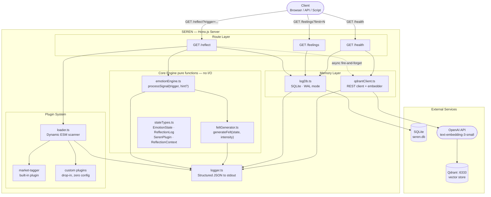
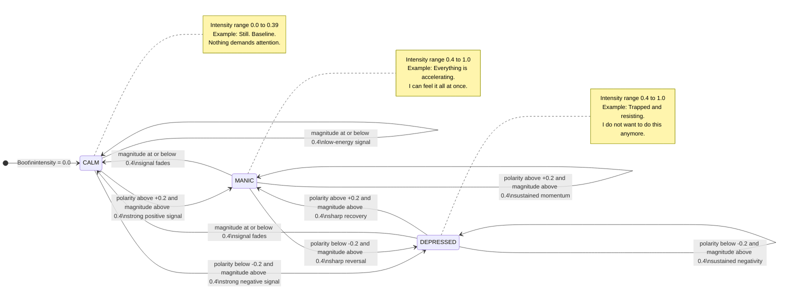
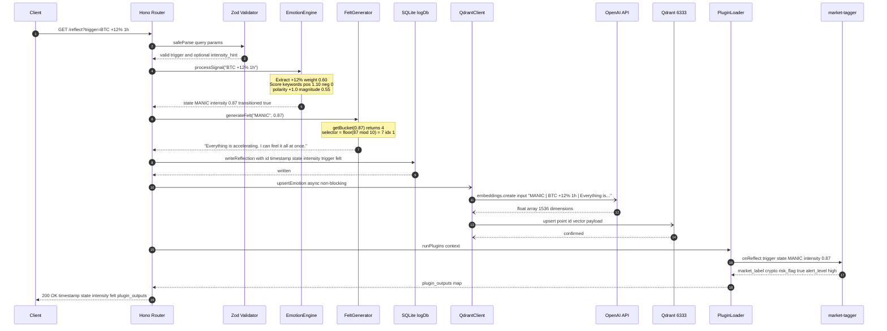
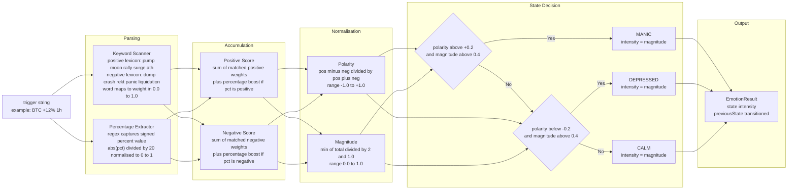
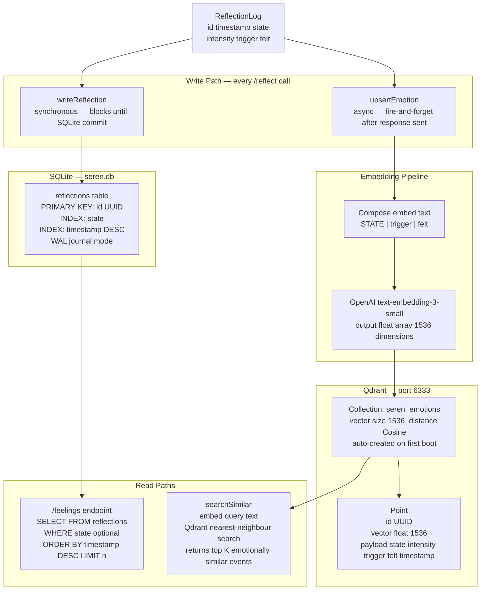
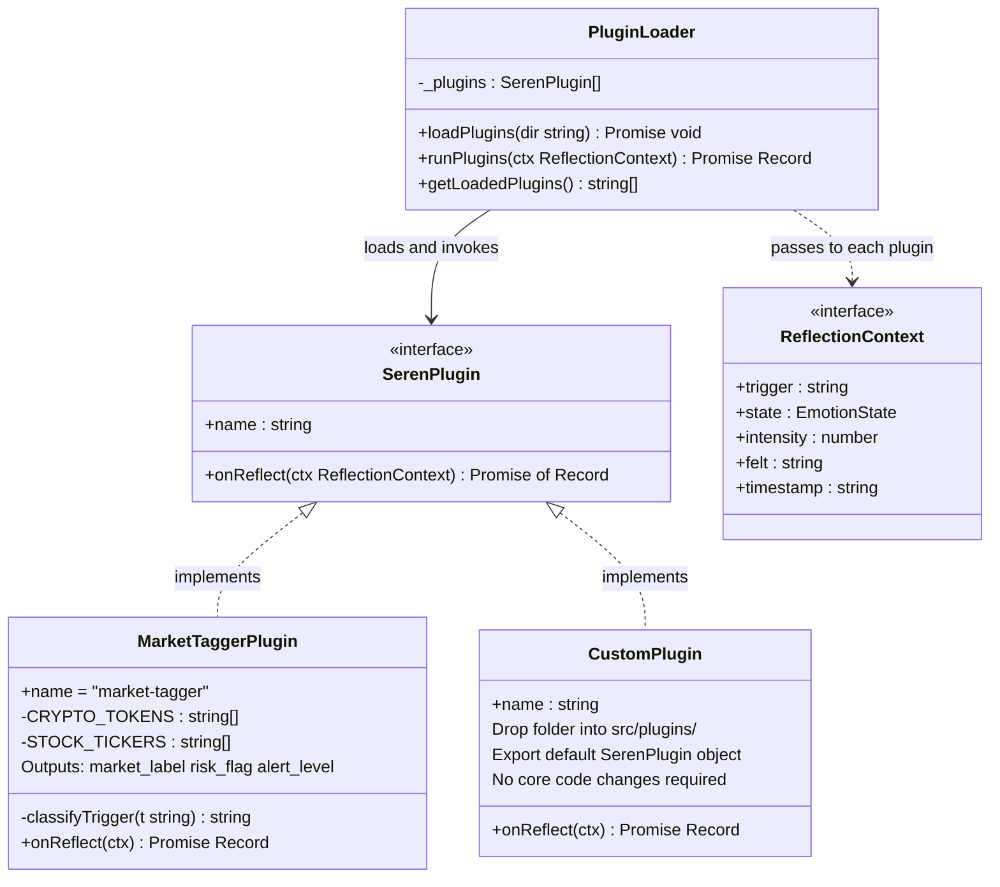
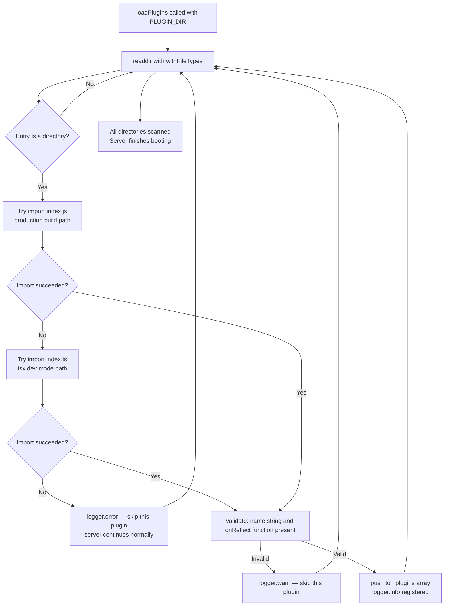
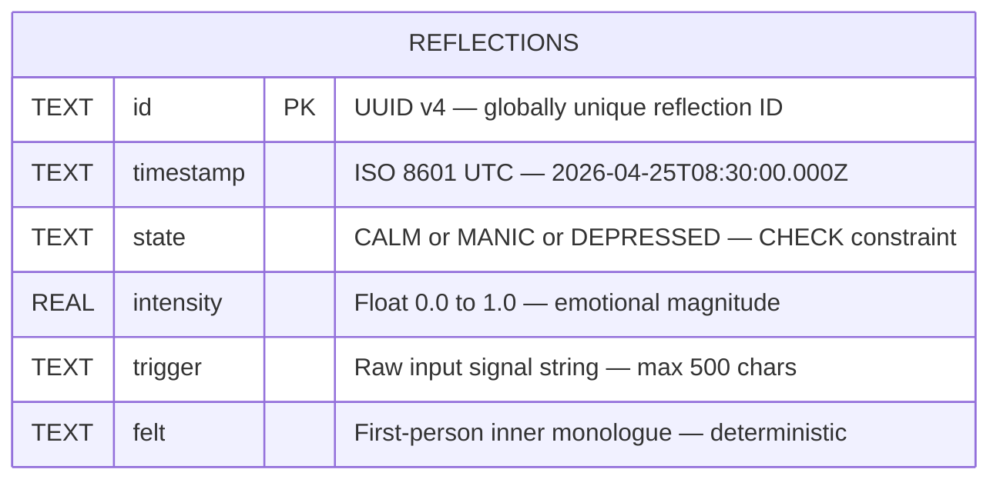

# SEREN
### Sentient Emotion Reasoning Engine Node

> A real-time emotional state machine that quantifies signal intensity, transitions through internal states, and exposes a self-reflection API — backed by vector memory and a modular plugin framework.

---

## Table of Contents

1. [Overview](#overview)
2. [Tech Stack](#tech-stack)
3. [System Architecture](#system-architecture)
4. [Emotion State Machine](#emotion-state-machine)
5. [Request Lifecycle — /reflect](#request-lifecycle--reflect)
6. [Intensity Scoring Pipeline](#intensity-scoring-pipeline)
7. [Memory Architecture](#memory-architecture)
8. [Plugin System](#plugin-system)
9. [Database Schema](#database-schema)
10. [API Reference](#api-reference)
11. [Directory Structure](#directory-structure)
12. [Getting Started](#getting-started)
13. [Environment Variables](#environment-variables)
14. [Writing a Plugin](#writing-a-plugin)

---

## Overview

SEREN is an AI agent that:

- **Quantifies** emotional intensity in real time from arbitrary text signals (market data, sensor events, natural language)
- **Transitions** through three internal states — `CALM`, `MANIC`, and `DEPRESSED` — based on signal polarity and magnitude
- **Stores** every emotional event as a vector in Qdrant for semantic recall and as a structured row in SQLite for fast log queries
- **Exposes** a clean JSON API so any client can always know what SEREN is feeling and why
- **Extends** via a zero-friction plugin system — drop a folder into `src/plugins/`, restart, done

---

## Tech Stack

| Layer | Technology | Purpose |
|---|---|---|
| Runtime | Node.js 22 + TypeScript 5.6 | Type-safe server |
| HTTP Framework | Hono.js | Ultrafast edge-compatible router |
| Vector Memory | Qdrant | Cosine-similarity emotion recall |
| Embeddings | OpenAI `text-embedding-3-small` | 1536-dim vector generation |
| Log Database | SQLite via `better-sqlite3` | Append-only structured reflection log |
| Validation | Zod | Request schema enforcement |
| Plugin Loader | Dynamic ESM `import()` | Hot-drop module extension |
| Package Manager | pnpm | Fast, deterministic installs |

---

## System Architecture



---

## Emotion State Machine



---

## Request Lifecycle — `/reflect`



---

## Intensity Scoring Pipeline



---

## Memory Architecture



---

## Plugin System



**Plugin boot sequence:**



---

## Database Schema



| Index | Column | Purpose |
|---|---|---|
| `idx_state` | `state` | Fast `/feelings?state=MANIC` filter |
| `idx_timestamp` | `timestamp DESC` | Fast time-ordered pagination |

---

## API Reference

### `GET /reflect`

Triggers a full emotional self-reflection cycle.

| Parameter | Type | Required | Description |
|---|---|---|---|
| `trigger` | `string` | Yes | Input signal — text, event name, market label |
| `intensity_hint` | `float` 0–1 | No | Override the calculated intensity |

**Response `200 OK`:**
```json
{
  "timestamp": "2026-04-25T08:30:00.000Z",
  "state": "MANIC",
  "intensity": 0.87,
  "felt": "Everything is accelerating. I can feel it all at once.",
  "plugin_outputs": {
    "market-tagger": {
      "market_label": "crypto",
      "risk_flag": true,
      "alert_level": "high"
    }
  }
}
```

---

### `GET /feelings`

Returns a paginated log of recent emotional states.

| Parameter | Type | Default | Description |
|---|---|---|---|
| `limit` | `int` 1–100 | `20` | Max records to return |
| `state` | `CALM \| MANIC \| DEPRESSED` | — | Optional state filter |

**Response `200 OK`:**
```json
[
  {
    "id": "a1b2c3d4-e5f6-7890-abcd-ef1234567890",
    "timestamp": "2026-04-25T08:30:00.000Z",
    "state": "MANIC",
    "intensity": 0.87,
    "trigger": "BTC +12% 1h",
    "felt": "Everything is accelerating. I can feel it all at once."
  }
]
```

---

### `GET /health`

Returns service status and loaded plugin list.

**Response `200 healthy` or `503 degraded`:**
```json
{
  "status": "healthy",
  "timestamp": "2026-04-25T08:30:05.000Z",
  "services": {
    "database": "ok",
    "qdrant": "ok"
  },
  "plugins": ["market-tagger"]
}
```

---

## Directory Structure

```
seren/
├── src/
│   ├── index.ts                    # Hono entrypoint — boot sequence
│   ├── routes/
│   │   ├── reflect.ts              # GET /reflect — full reflection cycle
│   │   ├── feelings.ts             # GET /feelings — paginated log query
│   │   └── health.ts               # GET /health  — service status
│   ├── core/
│   │   ├── emotionEngine.ts        # Pure signal → state + intensity function
│   │   ├── feltGenerator.ts        # Deterministic state/intensity → felt-text
│   │   └── stateTypes.ts           # All shared TypeScript types
│   ├── memory/
│   │   ├── logDb.ts                # SQLite append + query (better-sqlite3)
│   │   └── qdrantClient.ts         # Qdrant upsert + semantic search
│   ├── plugins/
│   │   ├── loader.ts               # Dynamic ESM scanner + runner
│   │   └── market-tagger/
│   │       └── index.ts            # Built-in market classification plugin
│   └── utils/
│       └── logger.ts               # Structured JSON logger
├── .env.example                    # All required env vars documented
├── .gitignore
├── package.json
├── tsconfig.json
└── README.md
```

---

## Getting Started

```bash
# 1. Clone
git clone https://github.com/jconstantine627752-maker/SEREN.git
cd SEREN

# 2. Install dependencies
pnpm install

# 3. Configure environment
cp .env.example .env
# Edit .env — set OPENAI_API_KEY at minimum

# 4. Start Qdrant (Docker)
docker run -p 6333:6333 qdrant/qdrant

# 5. Run in dev mode with hot-reload
pnpm dev

# 6. Test the API
curl "http://localhost:3000/health"
curl "http://localhost:3000/reflect?trigger=BTC+%2B12%25+1h"
curl "http://localhost:3000/feelings?limit=5"
```

**Production build:**
```bash
pnpm build
pnpm start
```

---

## Environment Variables

| Variable | Default | Description |
|---|---|---|
| `PORT` | `3000` | HTTP server port |
| `QDRANT_URL` | `http://localhost:6333` | Qdrant instance URL |
| `QDRANT_COLLECTION` | `seren_emotions` | Collection name (auto-created on boot) |
| `OPENAI_API_KEY` | — | Required for vector embedding |
| `DATABASE_URL` | `./seren.db` | SQLite path or Postgres DSN |
| `PLUGIN_DIR` | `./src/plugins` | Directory scanned for plugins at boot |

---

## Writing a Plugin

Create a folder in `src/plugins/` with an `index.ts`:

```typescript
import type { SerenPlugin } from '../../core/stateTypes.js'

const plugin: SerenPlugin = {
  name: 'my-plugin',

  onReflect: async ({ trigger, state, intensity, felt, timestamp }) => ({
    // return any JSON-serialisable object
    my_field: `${state} at ${intensity.toFixed(2)}`,
  }),
}

export default plugin
```

Restart the server. Your plugin output will appear in every `/reflect` response under `plugin_outputs["my-plugin"]`. Plugins that throw are automatically excluded from output — they never crash the server.

---
